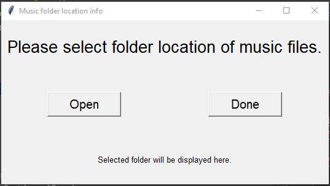
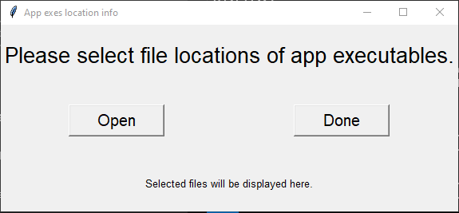
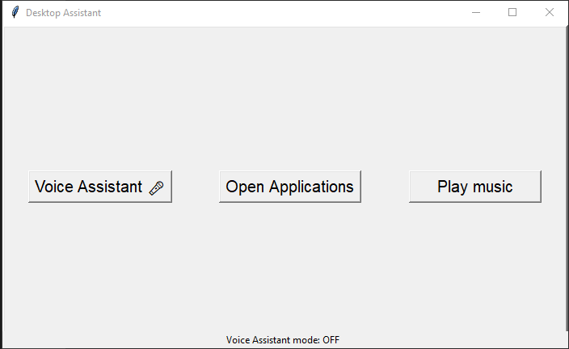

# DesktopAssistant

This is a desktop assistant project the following features:
- Voice Assistant
- Opening multiple desktop applications in one click
- Play music from local folders

Voice assistant feature interacts with the user to provide responses to the requests user queries. This may include news, jokes, music, wikipedia information about a famous personality etc.,

When user runs app for the first time, the program asks for location of music files and app executables in the filesystem. These get stored at "C://Desktop Assistant/" folder, so that the app can use from next time onwards.
Here are some screenshots of the app asking for those locations:

After the user gives the file locations once, running the app from next time will not prompt for those locations and the main UI gets displayed. 
Here is a screenshot of the main UI:

**Note:**
If the user wants to add/delete the list of apps that open on clicking "Open Applications" button, he can do so by modifying the file "C://Desktop Assistant/app_exe_locations.txt"

Similarly, if the folder location from which music files get picked needs to be changed, he can do so by modifying the file "C://Desktop Assistant/music_location.txt"
